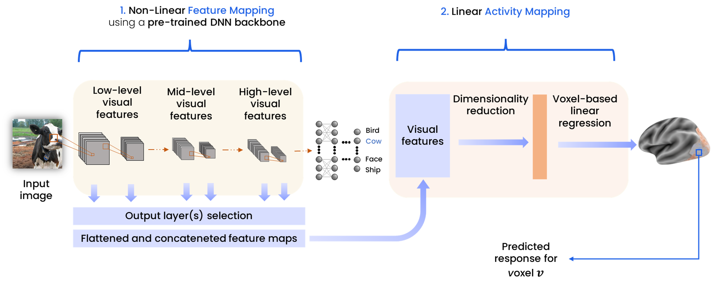

## Code for the Master's Thesis "Deep Neural Encoding Models of the Human Visual Cortex to Predict fMRI Responses to Natural Visual Scenes".
### Research Internship - MSc in Data Science - University of Milano-Bicocca - Imaging and Vision Laboratory.

This is a repository for [Algonauts2023 competition](http://algonauts.csail.mit.edu).  
Developed by [@giocoal](https://github.com/giocoal)

[![Contributors][contributors-shield]][contributors-url]
[![Forks][forks-shield]][forks-url]
[![Stargazers][stars-shield]][stars-url]
[![Issues][issues-shield]][issues-url]
[![MIT License][license-shield]][license-url]
[![LinkedIn][linkedin-shield]][linkedin-url]
[![Slides][paper-shield]][slides-url]
[![Thesis][thesis-shield]][thesis-url]

## Table of contents

* [Introduction](#introduction)
* [Slides](https://www.slideshare.net/slideshow/masters-thesis-data-science-presentation/266926165) and [Thesis](https://drive.google.com/file/d/1hf3gs0VAdlfDIobfEtqeOhS8HHD0UfpI/view?usp=sharing)
* [Requirements](#requirements)
* [Status](#status)
* [Contact](#contact)
* [Citation](#citation)
<!-- * [Usage](#usage) -->

## Introduction

One of the main objectives of *computational neuroscience* is to comprehend the biological mechanisms that enable humans to perceive, process, and understand complex visual scenes. *Visual neural encoding models* are computational models that mimic the hierarchical processes underlying the human visual system and aim to explain the relationship between visual stimuli and corresponding neural activations evoked in the human visual cortex. A visual encoder can serve as a structured system for testing biological hypotheses concerning how visual information is processed, represented, and organized in the human brain.

The main objective of this thesis is to develop a comprehensive *voxel-based* and subject-specific image-fMRI neural encoding model of the human visual cortex based on Deep Neural Networks (DNNs) and *transfer learning* for the prediction of local neural *blood oxygen level-dependent* (BOLD) *functional magnetic resonance imaging* (fMRI) responses to complex visual stimuli.

We applied a two-step *linearizing* strategy to visual encoding, based on the use of two separate computational models respectively for the non-linear *feature mapping* (employing pre-trained computer vision DNNs as feature extractors) of the stimulus image into its latent representations and the subsequent linear *activity mapping* of the visual features into the BOLD response amplitudes of the individual voxels, using Principal Component Analysis (PCA) to reduce the dimensionality of the visual features and independent *ridge regression* models to map the PCA components in the activity of each voxel. 

Furthermore, in order to meet the criteria of *mappability* and *predictivity* that characterize a good encoding model, we adopted a *ROI-wise* and *mixed* encoding strategy, modeling the encoding of voxels belonging to different *regions of interest* (ROIs, groups of voxels that share functional properties) separately to achieve maximum accuracy across the entire visual cortex and within individual ROIs. To determine the best feature mapping method for each region of interest, we tested the extraction of visual features from layers at varying depths of several pre-trained Convolutional Neural Networks (AlexNet, ZFNet, RetinaNet, EfficientNet-B2, VGG-16, VGG-19) and Vision Transformers (ViTs), characterized by different training parameters (training goal, training dataset, and learning method). During this testing phase, the existence of similarity and functional alignment between the hierarchical architecture of the pre-trained DNNs and the structure of the visual cortex emerged, a result that motivated the use of the ROI-wise strategy.

The proposed model achieves, in predicting the neural responses to the images of the test set of the *Algonauts Project 2023 Challenge* dataset, an overall accuracy score of 0.52, expressed as the *Median Noise Normalized Squared Correlation* (MNNSC) across all voxels of the cortical surfaces of all subjects, outperforming the baseline model proposed by the challenge organizers (which achieved a score of 0.41). The results of this thesis demonstrate the effectiveness of mixed, ROI-wise, deep, and transfer learning-based approaches in the context of image-fMRI visual encoding modeling.

## Dataset

The thesis project was developed using the [*Algonauts Project 2023 Challenge* dataset](https://docs.google.com/forms/d/e/1FAIpQLSehZkqZOUNk18uTjRTuLj7UYmRGz-OkdsU25AyO3Wm6iAb0VA/viewform), a large collection of eight subjects' fMRI responses to visual scenes. During the fMRI scans, each subject viewed 9,000-10,000 colored natural scenes, and the corresponding activations for the 39,548 voxels of the visual cortex were encoded as *betas*, which are single-value estimates of the amplitude of the BOLD fMRI response, indirectly representing the activation or deactivation of the neurons in a specific voxel evoked by viewing a stimulus.

## Requirements

- Python 3.9.16
- CUDA Toolkit 11.6
- CuDNN 8302
- Pillow 9.2.0
- NiBabel 5.2.0
- Nilearn 0.10.3
- Plotly 5.14.1
- torch 1.13.0
- torchvision 0.14.0
- Transformers 4.31.0
- PyTorchCV 0.0.67
- EfficientNet-PyTorch 0.7.1
- matplotlib 3.5.2
- numpy 1.22.4
- pandas 1.5.3
- scikit_learn 1.1.1
- scipy 1.7.3
- tqdm 4.64.1
- torchmetrics 0.11.4
- plotly 5.14.1

## Status

 Project is:   _Done_

## Contact

Feel free to contact me!
- [Google Scholar](https://scholar.google.com/citations?user=XwyRP1wAAAAJ&hl=en&oi=sra)
- [Linkedin](https://www.linkedin.com/in/giorgio-carbone-63154219b/)
- [Github](https://github.com/giocoal)

<!-- MARKDOWN LINKS & IMAGES -->
<!-- https://www.markdownguide.org/basic-syntax/#reference-style-links -->
[contributors-shield]: https://img.shields.io/github/contributors/giocoal/algonauts2023-image-fMRI-encoding-model.svg?style=for-the-badge
[contributors-url]: https://github.com/giocoal/algonauts2023-image-fMRI-encoding-model/graphs/contributors
[forks-shield]: https://img.shields.io/github/forks/giocoal/algonauts2023-image-fMRI-encoding-model.svg?style=for-the-badge
[forks-url]: https://github.com/giocoal/algonauts2023-image-fMRI-encoding-model/network/members
[stars-shield]: https://img.shields.io/github/stars/giocoal/algonauts2023-image-fMRI-encoding-model.svg?style=for-the-badge
[stars-url]: https://github.com/giocoal/algonauts2023-image-fMRI-encoding-model/stargazers
[issues-shield]: https://img.shields.io/github/issues/giocoal/algonauts2023-image-fMRI-encoding-model.svg?style=for-the-badge
[issues-url]: https://github.com/giocoal/algonauts2023-image-fMRI-encoding-model/issues
[license-shield]: https://img.shields.io/github/license/giocoal/algonauts2023-image-fMRI-encoding-model.svg?style=for-the-badge
[license-url]: https://github.com/giocoal/algonauts2023-image-fMRI-encoding-model/blob/master/LICENSE
[linkedin-shield]: https://img.shields.io/badge/-LinkedIn-black.svg?style=for-the-badge&logo=linkedin&colorB=555
[linkedin-url]: https://www.linkedin.com/in/giorgio-carbone-63154219b/
[thesis-shield]: https://img.shields.io/badge/Read%20Thesis%20-grey?style=for-the-badge
[thesis-url]: https://drive.google.com/file/d/1hf3gs0VAdlfDIobfEtqeOhS8HHD0UfpI/view?usp=sharing
[paper-shield]: https://img.shields.io/badge/Read%20Slides%20-grey?style=for-the-badge
[slides-url]: https://www.slideshare.net/slideshow/masters-thesis-data-science-presentation/266926165
[product-screenshot]: images/screenshot.png
[Next.js]: https://img.shields.io/badge/next.js-000000?style=for-the-badge&logo=nextdotjs&logoColor=white
[Next-url]: https://nextjs.org/
[React.js]: https://img.shields.io/badge/React-20232A?style=for-the-badge&logo=react&logoColor=61DAFB
[React-url]: https://reactjs.org/
[Vue.js]: https://img.shields.io/badge/Vue.js-35495E?style=for-the-badge&logo=vuedotjs&logoColor=4FC08D
[Vue-url]: https://vuejs.org/
[Angular.io]: https://img.shields.io/badge/Angular-DD0031?style=for-the-badge&logo=angular&logoColor=white
[Angular-url]: https://angular.io/
[Svelte.dev]: https://img.shields.io/badge/Svelte-4A4A55?style=for-the-badge&logo=svelte&logoColor=FF3E00
[Svelte-url]: https://svelte.dev/
[Laravel.com]: https://img.shields.io/badge/Laravel-FF2D20?style=for-the-badge&logo=laravel&logoColor=white
[Laravel-url]: https://laravel.com
[Bootstrap.com]: https://img.shields.io/badge/Bootstrap-563D7C?style=for-the-badge&logo=bootstrap&logoColor=white
[Bootstrap-url]: https://getbootstrap.com
[JQuery.com]: https://img.shields.io/badge/jQuery-0769AD?style=for-the-badge&logo=jquery&logoColor=white
[JQuery-url]: https://jquery.com